<a href="https://www.nilsbtr.de">
  <picture>
    <source media="(prefers-color-scheme: dark)" srcset="./assets/header-dark.svg" />
    <source media="(prefers-color-scheme: light)" srcset="./assets/header-light.svg" />
    
  </picture>
</a>

- **Based in** Braunschweig, Germany
- **Building** full-stack web apps, mostly TypeScript with Next.js or Astro
- **Backend** Go when performance matters, Python for AI features and scripts
- **Exploring** TanStack Start, Convex, GSAP and Flutter
- **Speaking** German and English
- **On GitHub** most of my code lives in private repos, so this profile is quiet. More on [nilsbtr.de](https://www.nilsbtr.de)

 

<a href="https://www.nilsbtr.de/stack">
  <picture>
    <source media="(prefers-color-scheme: dark)" srcset="./assets/stack-dark.svg" />
    <source media="(prefers-color-scheme: light)" srcset="./assets/stack-light.svg" />
    
  </picture>
</a>

 
 

[nilsbtr.de](https://www.nilsbtr.de) · [mail@nilsbtr.de](mailto:mail@nilsbtr.de)

